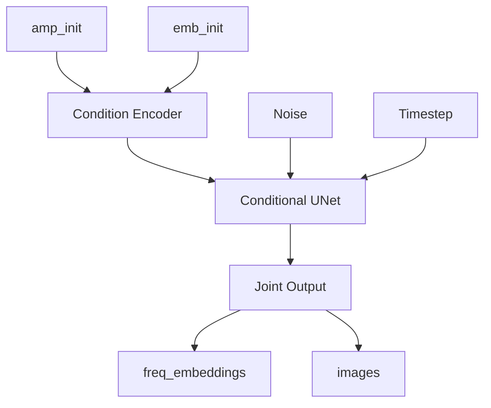

# ECG Diffusion Model

A conditional diffusion model for generating ECG frequency embeddings and images from amplitude and embedding initializations using DDIM (Denoising Diffusion Implicit Models).

## Architecture

The model uses a conditional diffusion approach where two inputs (amp_init and emb_init) are encoded and used as conditions to generate two outputs (freq_embeddings and images).



## Features

- **Conditional Generation**: Takes two inputs (amp_init, emb_init) and generates two outputs (freq_embeddings, images)
- **DDIM Sampling**: Fast deterministic sampling with configurable steps
- **Multi-Output Support**: Jointly generates frequency embeddings and images
- **Flexible Configuration**: YAML-based configuration system
- **Training Utilities**: Complete training pipeline with EMA, mixed precision, and checkpointing
- **Visualization Tools**: Built-in visualization and comparison utilities

## Installation

1. Clone the repository:
```bash
git clone <repository-url>
cd ecg-diffusion
```

2. Install dependencies:
```bash
pip install -r requirements.txt
```

## Dataset Structure

The dataset should be organized as follows:

```
dataset/
├── images/
│   ├── train/
│   │   └── *.npy
│   └── val/
│       └── *.npy
├── freq_embeddings/
│   ├── train/
│   │   └── *.npy
│   └── val/
│       └── *.npy
└── inits/
    ├── amp_init/
    │   ├── train/
    │   │   └── *.npy
    │   └── val/
    │       └── *.npy
    └── emb_init/
        ├── train/
        │   └── *.npy
        └── val/
            └── *.npy
```

Files with the same name across directories are paired together (e.g., `100_lead0_z0_w000.npy`).

## Usage

### Training

Train the model with default configuration:

```bash
python train.py --config configs/default.yaml
```

If you encounter CUDA out of memory errors, use the low memory configuration:

```bash
python train.py --config configs/low_memory.yaml
```

The low memory config uses:
- Smaller model (32 base channels instead of 64)
- Batch size of 1 with gradient accumulation
- Disabled attention layers
- Reduced condition dimensions

Resume training from a checkpoint:

```bash
python train.py --config configs/default.yaml --resume checkpoints/latest_checkpoint.pt
```

### Inference

Generate samples from a trained model:

```bash
python inference.py \
    --checkpoint checkpoints/best_checkpoint.pt \
    --num-samples 4 \
    --num-steps 50 \
    --visualize
```

Compare generated samples with ground truth:

```bash
python inference.py \
    --checkpoint checkpoints/best_checkpoint.pt \
    --num-samples 4 \
    --compare \
    --visualize
```

Generate from custom input directory:

```bash
python inference.py \
    --checkpoint checkpoints/best_checkpoint.pt \
    --input-dir path/to/inputs \
    --output-dir path/to/outputs \
    --num-samples 8
```

### Dataset Analysis

Analyze the dataset structure and visualize samples:

```bash
python analyze_dataset.py --file-name 100_lead0_z0_w000 --dataset-path dataset
```

Or use as a Python object:

```python
from analyze_dataset import DatasetVisualizer

visualizer = DatasetVisualizer("100_lead0_z0_w000", "dataset")
visualizer.visualize()  # Only visualization
# or
visualizer.run_full_analysis()  # Full analysis
```

## Configuration

The model can be configured via YAML files. See `configs/default.yaml` for all available options:

- **Dataset**: Path, splits, batch size, normalization, augmentation
- **Model**: Architecture parameters for condition encoder, UNet, and diffusion
- **Training**: Learning rate, epochs, EMA, mixed precision, checkpointing
- **Inference**: Sampling steps, batch size, output directory

### Key Hyperparameters

- `num_timesteps`: Number of diffusion timesteps (default: 1000)
- `num_inference_steps`: DDIM sampling steps (default: 50, can be reduced for faster inference)
- `eta`: DDIM parameter (0.0 = deterministic, 1.0 = DDPM)
- `base_channels`: Base number of channels in UNet (default: 64)
- `condition_dim`: Condition feature dimension (default: 256)

## Model Architecture

### Condition Encoder

Encodes two input conditions (amp_init, emb_init) into unified condition features:
- Separate CNN encoders for each input
- Cross-attention or concatenation-based fusion
- Spatial alignment for different input sizes

### Conditional UNet

UNet-based denoising network:
- Encoder-decoder architecture with skip connections
- Timestep embeddings (sinusoidal)
- Cross-attention layers for condition integration
- Multi-head output for joint generation

### DDIM Diffusion

Denoising Diffusion Implicit Models:
- Forward process: q(x_t | x_0)
- Reverse process: p(x_{t-1} | x_t, condition)
- Deterministic sampling (faster than DDPM)
- Configurable sampling steps

## Training Details

- **Loss Function**: Combined loss with separate terms for freq_embeddings and images, plus consistency loss
- **Optimizer**: AdamW with cosine annealing learning rate schedule
- **EMA**: Exponential moving average for stable training
- **Mixed Precision**: FP16 training for faster training and lower memory usage
- **Gradient Accumulation**: Support for effective larger batch sizes

## Output

Generated samples are saved as:
- `{filename}_freq_embeddings.npy`: Frequency embeddings
- `{filename}_images.npy`: Images

Visualizations are saved as PNG files when using `--visualize` flag.

## Project Structure

```
ecg-diffusion/
├── models/
│   ├── condition_encoder.py  # Condition encoder
│   ├── unet.py              # Conditional UNet
│   └── diffusion.py         # DDIM diffusion process
├── data/
│   └── dataset.py           # Dataset loader
├── training/
│   ├── trainer.py           # Training loop
│   └── losses.py            # Loss functions
├── inference/
│   └── sampler.py           # DDIM sampler
├── utils/
│   ├── config.py            # Configuration utilities
│   └── visualization.py     # Visualization tools
├── configs/
│   └── default.yaml         # Default configuration
├── train.py                 # Training script
├── inference.py             # Inference script
├── analyze_dataset.py       # Dataset analysis tool
└── requirements.txt         # Dependencies
```

## Requirements

- Python >= 3.8
- PyTorch >= 2.0.0
- CUDA (optional, for GPU training)
- See `requirements.txt` for full list

 